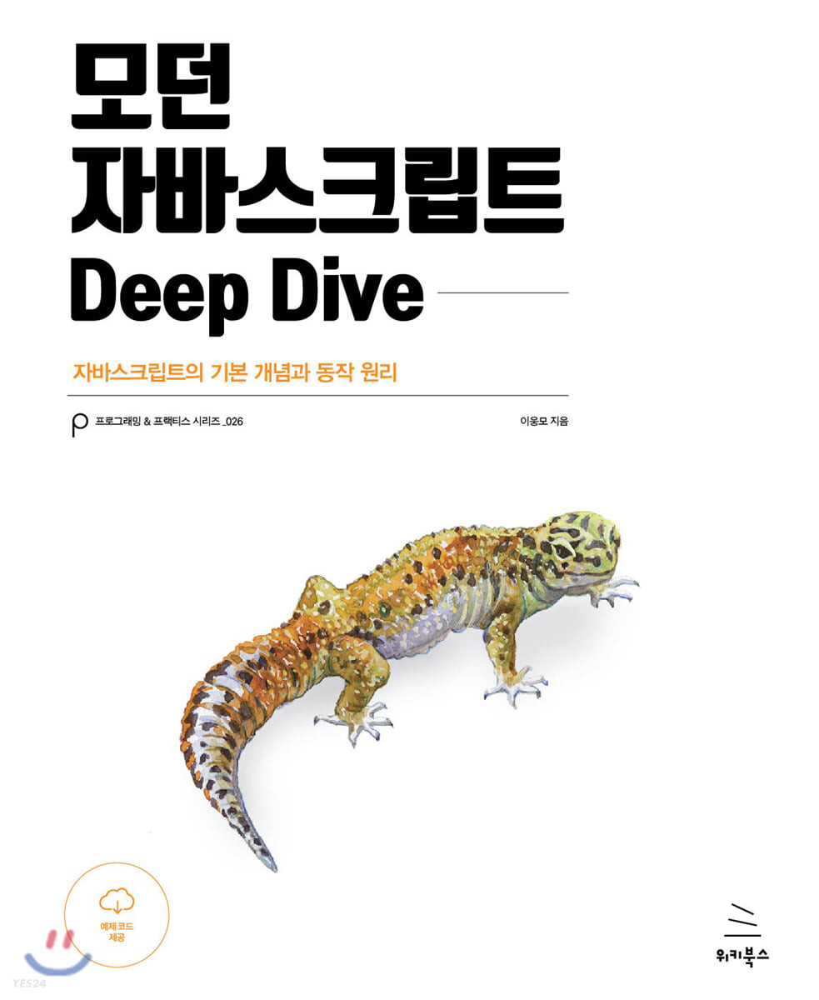

# 모던 자바스크립트 Deep Dive

"모던 자바스크립트 Deep Dive" 책으로 공부하는 Javascript 언어

#### 셀프 스터디 진행일정 (12주)

- **5월 8일(월) ~ 7월 8일(토)**

- **매주 일요일마다 그 다음 주의 정해진 학습 챕터 설정**

#### 셀프 스터디 진행방식

- 매주마다 정해진 양을 공부합니다.
    - 정해진 양을 공부하는데 있어서 배운내용, 혹은 공유하고 싶은 내용을 작성합니다.
    - 아이템별 적용한 코드, 혹은 작성한 코드를 개인 github에 올려 공유합니다.
    - 매주 이전 한 주에 대한 피드백과 개선 사항에 대해 충분히 고민하는 블로그를 작성한다.
 

## Code Samples

아래에서 각 항목에 대한 독립 실행형 코드 샘플에 대한 링크가 포함된 전체 목차를 만들어 갈 것입니다. 모든 코드 샘플은 예상되는 오류(혹은 다른 오류 없음)와 예상되는 유형을 생성 할 예정입니다.
 
 

### 주차별 도서 **학습** 가이드

- **Chapter 1: 프로그래밍**
  - [1주차][:memo: Item 1-1]: 프로그래밍이란?
  - [1주차][:memo: Item 1-2]: 프로그래밍 언어
  - [1주차][:memo: Item 1-3]: 구문과 의미

- **Chapter 2: 자바스크립트란**
  - [1주차][:memo: Item 2-1]: 자바스크립트의 탄생
  - [1주차][:memo: Item 2-2]: 자바스크립트의 표준화
  - [1주차][:memo: Item 2-3]: 자바스크립트 성장의 역사
  - [1주차][:memo: Item 2-4]: 자바스크립트와 ECMAScript
  - [1주차][:memo: Item 2-5]: 자바스크립트의 특징
  - [1주차][:memo: Item 2-6]: ES6 브라우저황지원 현황

- **Chapter 3: 자바스크립트 개발 환경과 실행 방법**
  - [1주차][:memo: Item 3-1]: 자바스크립트 실행 환경
  - [1주차][:memo: Item 3-2]: 웹브라우저
  - [1주차][:memo: Item 3-3]: Node.js
  - [1주차][:memo: Item 3-4]: 비주얼 스튜디오 코드

- **Chapter 4: 변수**
  - [1주차][:memo: Item 4-1]: 변수란 무엇인가?
  - [1주차][:memo: Item 4-2]: 식별자
  - [1주차][:memo: Item 4-3]: 변수 선언
  - [1주차][:memo: Item 4-4]: 변수 선언의 실행 시점과 변수 호이스팅
  - [1주차][:memo: Item 4-5]: 값의 할당
  - [1주차][:memo: Item 4-6]: 값의 재할당
  - [1주차][:memo: Item 4-7]: 식별자 네이밍 규칙

- **Chapter 5: 표현식과 문**
  - [1주차][:memo: Item 5-1]: 값
  - [1주차][:memo: Item 5-2]: 리터럴
  - [1주차][:memo: Item 5-3]: 표현식
  - [1주차][:memo: Item 5-4]: 문
  - [1주차][:memo: Item 5-5]: 세미콜론과 세미콜론 자동 삽입 기능
  - [1주차][:memo: Item 5-6]: 표현식인 문과 표현식이 아닌 문

- **Chapter 6: 데이터 타입**
  - [1주차][:memo: Item 6-1]: 숫자 타입
  - [1주차][:memo: Item 6-2]: 문자열 타입
  - [1주차][:memo: Item 6-3]: 템플릿 리터럴
  - [1주차][:memo: Item 6-4]: 불리언 타입
  - [1주차][:memo: Item 6-5]: undefined 타입
  - [1주차][:memo: Item 6-6]: null 타입
  - [1주차][:memo: Item 6-7]: 심벌 타입
  - [1주차][:memo: Item 6-8]: 객체 타입
  - [1주차][:memo: Item 6-9]: 데이터 타입의 필요성
  - [1주차][:memo: Item 6-10]: 동적 타이밍

- **Chapter 7: 연산자**
  - [1주차][:memo: Item 7-1]: 산술 연산자
  - [1주차][:memo: Item 7-2]: 할당 연산자
  - [1주차][:memo: Item 7-3]: 비교 연산자
  - [1주차][:memo: Item 7-4]: 삼항 조건 연산자
  - [1주차][:memo: Item 7-5]: 논리 연산자
  - [1주차][:memo: Item 7-6]: 쉼표 연산자
  - [1주차][:memo: Item 7-7]: 그룹 연산자
  - [1주차][:memo: Item 7-8]: typeof 연산자
  - [1주차][:memo: Item 7-9]: 지수 연산자
  - [1주차][:memo: Item 7-10]: 그 외의 연산자
  - [1주차][:memo: Item 7-11]: 연산자의 부수 효과
  - [1주차][:memo: Item 7-12]: 연산자 우선순위
  - [1주차][:memo: Item 7-13]: 연산자 결합 순서

